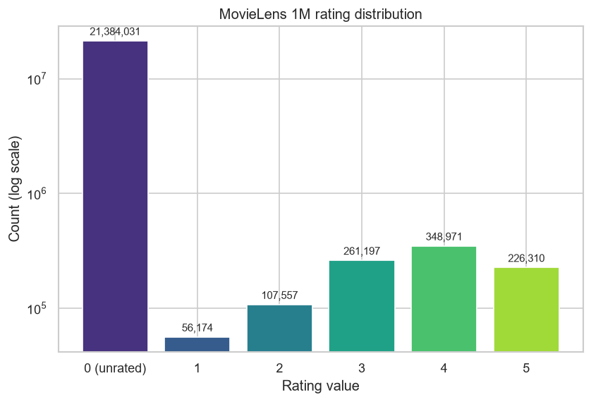
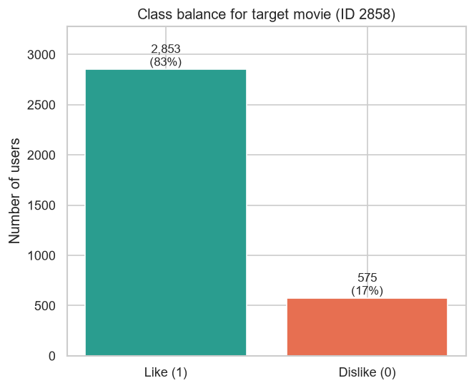
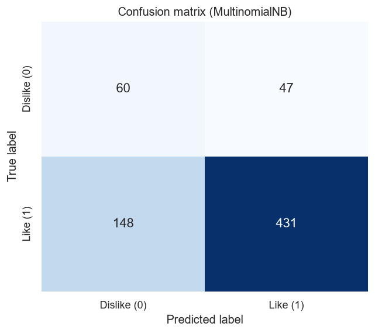
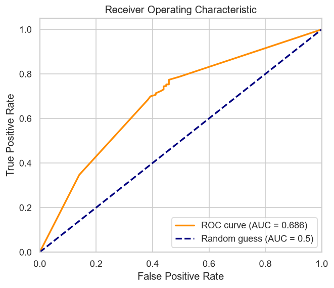
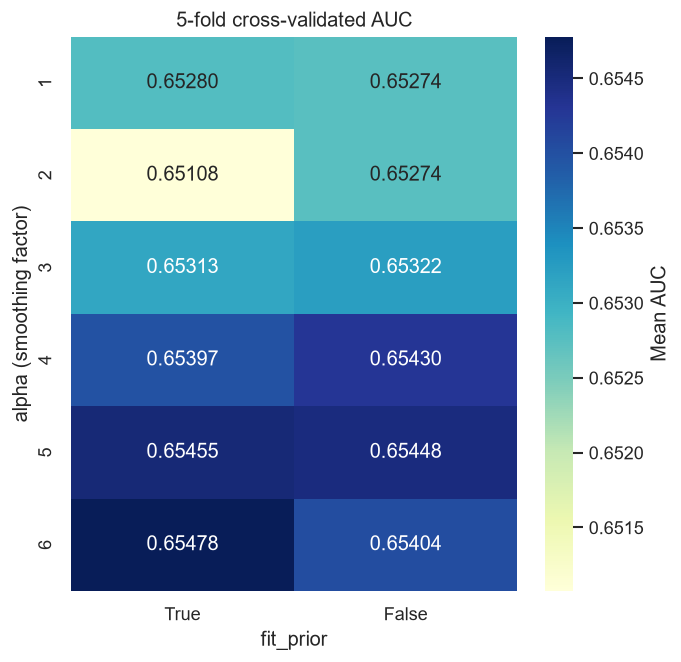
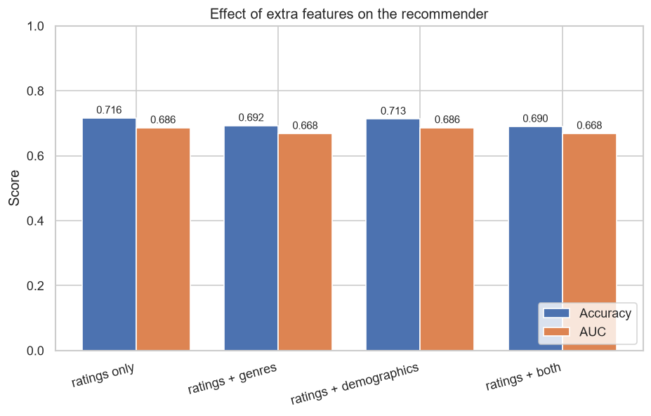
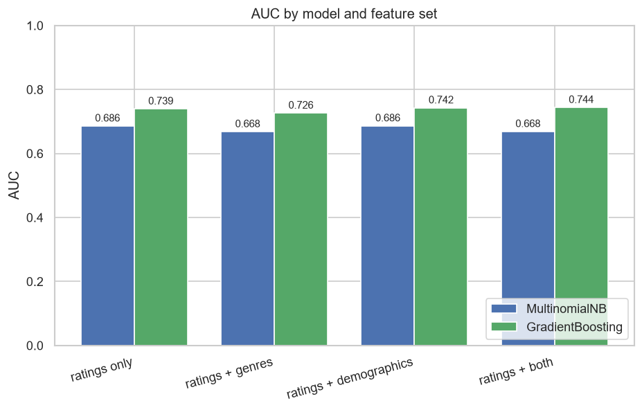

# Movie Recommendation Engine with Naïve Bayes

The project frames movie recommendation as a **binary classification** problem:
*given how a user rated other movies, predict whether they will like a target
movie.* It builds Naïve Bayes twice, i.e. -  once from scratch, once with scikit-learn —
then trains and evaluates it on the real [MovieLens 1M](https://grouplens.org/datasets/movielens/1m/)
dataset.

## Project layout

```
movie-recommendation-engine/
src/
   naive_bayes_from_scratch.py 
   naive_bayes_sklearn_toy.py
   data_prep.py 
   visualize.py                
   movie_recommender.py          
   evaluate.py                   
   tune.py                       
   features.py                   
   enhanced_recommender.py       
   gbt_comparison.py             
images/                           
data/                            
requirements.txt
README.md
```

## Setup

A virtual environment (`ml-env/`) is used for all dependencies.

```bash
# activate the venv, then:
pip install -r requirements.txt
```

The MovieLens 1M dataset can be downloaded here:

https://files.grouplens.org/datasets/movielens/ml-1m.zip

This produces `data/ml-1m/ratings.dat` (and `movies.dat`, `users.dat`).

## Steps taken

1. Naïve Bayes from scratch

2. Naive Bayes with scikit-learn

3. MovieLens 1M data preparation

4. Movie recommender on MovieLens 1M (~71.6% accuracy)

5. Classification metrics (confusion matrix, precision/recall/F1, ROC/AUC)

6. Hyperparameter tuning with k-fold cross-validation

7. Extra features — genre + demographic feature engineering

8. Model comparison — gradient-boosted trees vs Naïve Bayes

## Findings

### 1. Naïve Bayes from scratch

src/naive_bayes_from_scratch.py implements the four building blocks of the
algorithm being get_label_indices, get_prior, get_likelihood (with Laplace
smoothing) and get_posterior, and runs them on the following dataset:

| ID | m1 | m2 | m3 | Likes target |
|----|----|----|----|--------------|
| 1  | 0  | 1  | 1  | Y |
| 2  | 0  | 0  | 1  | N |
| 3  | 0  | 0  | 0  | Y |
| 4  | 1  | 1  | 0  | Y |
| 5  | 1  | 1  | 0  | **?** |

Running it reproduces the book's numbers exactly:

```
Prior:      {'Y': 0.75, 'N': 0.25}
Likelihood: {'Y': [0.4, 0.6, 0.4], 'N': [0.333, 0.333, 0.667]}
Posterior:  [{'Y': 0.9210, 'N': 0.0790}]
```

**Takeaway:** there is a **92.1%** probability the new user likes the target
movie. Laplace smoothing (smoothing=1) is essential — without it, the unseen
feature value m1=1 in the N class forces P(N|x)=0 and the model would
blindly predict Y every time.

### 2. Naive Bayes with scikit-learn

src/naive_bayes_sklearn_toy.py runs BernoulliNB(alpha=1.0, fit_prior=True) on
the same toy data. BernoulliNB is the correct estimator because the features
are binary. It agrees with the hand-written version to the last digit:

```
Predicted probabilities (N, Y): [[0.07896399 0.92103601]]
Prediction: ['Y']
```

**Takeaway:** validating a from-scratch model against a trusted library
implementation is a good sanity check, i.e. -  identical outputs confirm the manual
prior/likelihood/posterior math is correct. alpha here is scikit-learn's name
for the Laplace smoothing factor.

### 3. Preparing the MovieLens 1M data

src/data_prep.py turns the raw ratings into a classification dataset:

- Reads **1,000,209 ratings** from **6,040 users** across **3,706 movies**.
- Builds a dense `6040 × 3706` rating matrix (unrated cells = 0). The matrix is
  ~99% zeros — the data is extremely **sparse**.
- Picks the most-rated movie as the **target** (movie ID `2858`, *American
  Beauty*, with 3,428 ratings) so predictions can be validated.
- Frames it as binary classification: a user's ratings of the other 3,705 movies
  are the features `X`; the label `Y` is `1` if they rated the target **> 3**.

Resulting dataset:

```
Shape of X: (3428, 3705)
Shape of Y: (3428,)
2853 positive samples and 575 negative samples.
```

The rating distribution (log scale) shows just how sparse the matrix is — over
21M of the ~22.4M cells are unrated:



And the target movie's labels are clearly imbalanced:



**Takeaway:** the dataset is **imbalanced** (~83% positive / ~17% negative). That
is the recurring theme of the rest of the project: plain accuracy will look
flattering, so we need precision/recall/F1 and AUC to judge the model honestly.

### 4. Training the recommender (`MultinomialNB`)

src/movie_recommender.py splits the data 80/20 (random_state=42, stratified
class ratio preserved) and trains MultinomialNB(alpha=1.0, fit_prior=True).
MultinomialNB is used instead of BernoulliNB because the rating features are
integers 0–5, not binary.

```
Training samples: 2742, testing samples: 686
First 10 predictions: [1 1 1 0 0 0 1 1 1 1]
The accuracy is: 71.6%
```

**Takeaway:** the classifier recommends movies correctly about **three quarters**
of the time. But remember the class imbalance: ~83% of users
liked the target movie, so a naive "always predict like" baseline would already
score ~83% accuracy. **71.6% accuracy alone is therefore misleading**, which is
exactly why the next section digs into precision, recall, F1 and AUC.

### 5. Evaluating classification performance

src/evaluate.py computes the metrics that survive class imbalance. The
confusion matrix on the 686-sample test set:



|              | precision | recall | f1-score | support |
|--------------|-----------|--------|----------|---------|
| 0 (dislike)  | 0.29      | 0.56   | 0.38     | 107     |
| 1 (like)     | 0.90      | 0.74   | 0.82     | 579     |
| **accuracy** |           |        | **0.72** | 686     |

The ROC curve, with AUC = **0.686**:



**Takeaway:** the metrics tell the real story that accuracy hid. The model is
strong on the majority **like** class (F1 = 0.82) but weak on the minority
**dislike** class (F1 = 0.38) — it misses many dislikes (148 false negatives).
The **AUC of 0.686** is below the model's accuracy, and per the book's rule of
thumb (0.7–0.8 acceptable, 0.8–0.9 great) it sits just under "acceptable" — fair
given we use only the very sparse rating signal. This gap between accuracy and
AUC is the whole reason model tuning (next section) is judged on AUC, not
accuracy.

### 6. Tuning with k-fold cross-validation

src/tune.py runs 5-fold stratified cross-validation, grid-searching the
smoothing factor alpha between 1-6 and fit_prior an element of {True, False}, scoring each
combination by mean AUC:



```
Best params: alpha=6, fit_prior=True (mean CV AUC = 0.65478)
AUC with the best model: 0.6806
```

**Takeaway:** the most important result is what the heatmap *doesn't* show —
**all 12 combinations fall within ~0.003 AUC of each other**. On this sparse
rating signal the model is effectively insensitive to these hyperparameters, so
tuning buys almost nothing (the retrained "best" model reaches AUC 0.681, about
the same as the untuned 0.686). The real lever for improvement would be **better
features** (movie genres, user demographics), not hyperparameter search.

### 7. Adding genre and demographic features

*can we do better by also using movie genres
(`movies.dat`) and user demographics (`users.dat`)?* `src/features.py` builds two
extra feature blocks, and `src/enhanced_recommender.py` compares four feature
sets under the same `MultinomialNB` model and 80/20 split:

- **Genre features** (18 dims): for each user and genre, the sum of their ratings
  of movies in that genre — a genre-preference profile (target movie excluded so
  it can't leak the label).
- **Demographic features** (30 dims): one-hot gender + age bucket + occupation.

| Feature set            | Dims | Accuracy | AUC      |
|------------------------|------|----------|----------|
| ratings only (baseline)| 3705 | 71.6%    | 0.6857   |
| ratings + genres       | 3723 | 69.2%    | 0.6678   |
| ratings + demographics | 3735 | 71.3%    | **0.6862** |
| ratings + both         | 3753 | 69.0%    | 0.6684   |



**Takeaway (an honest negative result):** naïvely bolting on more features did
**not** help.

- **Genres made it worse** (AUC 0.686 → 0.668). The genre features are *sums of
  ratings*, so they take large values (tens to hundreds) next to the 0–5 movie
  features. `MultinomialNB` treats features like frequency counts, so these
  high-magnitude columns dominate the likelihood product and distort it.
- **Demographics were essentially neutral** — a negligible AUC gain (+0.0005),
  within noise.

This is a useful lesson in its own right: **more features ≠ better**, especially
when their scale or representation doesn't match the model's assumptions. To make
genre/demographic signals actually pay off you'd want either a model that handles
mixed-scale features (e.g. gradient-boosted trees, covered in the book's next
chapter), per-feature normalization, or a separate Naïve Bayes per feature type
whose probabilities are then combined — rather than concatenating everything into
one multinomial model.

### 8. The right model unlocks the features

Section 7's negative result raised a question: were the genre/demographic features
useless, or was `MultinomialNB` just the wrong tool? `src/gbt_comparison.py` re-runs
the exact same four feature sets with a **gradient-boosted tree**
(`HistGradientBoostingClassifier`). Trees split on thresholds, so they are
invariant to feature scale — a fair test of whether the features carry signal.

| Feature set            | NB AUC | GBT AUC | GBT accuracy |
|------------------------|--------|---------|--------------|
| ratings only           | 0.686  | 0.739   | 84.5%        |
| ratings + genres       | 0.668  | 0.726   | 84.7%        |
| ratings + demographics | 0.686  | 0.742   | 83.5%        |
| ratings + both         | 0.668  | **0.744** | 84.1%      |



**Takeaway:** the story flips completely.

- **The model matters more than the features here.** Just switching NB → GBT on
  the *same* ratings-only features lifts AUC from 0.686 to 0.739 and accuracy from
  71.6% to 84.5% — finally clearing the ~83% majority-class baseline.
- **With the right model, the extra features now help.** Under GBT, adding
  demographics and genres together gives the **best AUC (0.744)**, whereas under
  NB the same features *hurt*. The signal was there all along; NB's
  scale-sensitive likelihood just couldn't use it.

This closes the loop on Section 7: a negative result wasn't the end of the story —
it pointed at the model, not the data. (Gradient-boosted trees are the subject of
the book's Chapter 3, so this also previews where the book goes next.)

## Conclusions

- Naïve Bayes, implemented from scratch, exactly matches scikit-learn on the toy
  problem — the prior/likelihood/posterior math is verified.
- On MovieLens 1M the recommender reaches **~71.6% accuracy** and **AUC 0.686**
  using nothing but other-movie ratings.
- **Accuracy is the wrong headline metric here**: with an 83/17 class imbalance,
  a trivial "always recommend" baseline would beat it. Precision/recall/F1 and
  AUC reveal the model is good at confirming likes but poor at catching dislikes.
- Cross-validation shows the model is **insensitive to hyperparameter tuning** on
  this signal.
- Adding genre and demographic features (Exercise 1) did **not** improve results
  under `MultinomialNB` — genre rating-sums even hurt because their scale clashes
  with the model's count-based assumptions.
- Swapping in a **gradient-boosted tree** changed everything: AUC rose to **0.744**
  and accuracy to **~84%**, and the extra features now *helped* rather than hurt.
  The lesson: features and model must be chosen together — the same features can
  be harmful or helpful depending on the model that consumes them.

### Possible extensions

1. Tune the gradient-boosted tree (depth, learning rate, iterations) and add
   cross-validation, as done for Naïve Bayes.

## Attribution

Dataset: F. M. Harper and J. A. Konstan. 2015. *The MovieLens Datasets: History
and Context.* ACM TiiS 5, 4, Article 19. https://doi.org/10.1145/2827872
